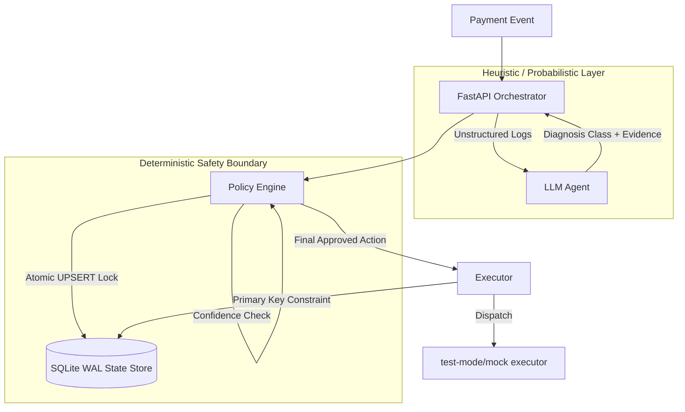

<div align="center">
  <h1>🛡️ Revenue Resilience AI</h1>
  <p><strong>A deterministic policy engine gated by a typed diagnostic simulator by default to safely recover failed payments at scale.</strong></p>
  <p><i>Built for the Razorpay Buildathon 2026</i></p>
</div>

<br />

## 📖 Executive Summary
Most "AI Agents" are built as open-ended loops: the LLM is given tools, told a goal, and allowed to mutate state directly. In the financial sector—especially in payment gateways like Razorpay—this is unacceptably dangerous. 

**Revenue Resilience AI reverses that architecture.** 

We strictly sandbox the LLM, stripping it of all execution authority. Its only job is to analyze unstructured context and output a typed diagnostic proposal. The absolute authority remains with a **Deterministic Policy Engine** that evaluates that diagnosis against hard business constraints (economic value, confidence, idempotency thresholds). 

The LLM proposes *why* a failure occurred. The Policy Engine decides *if* and *how* to act. The Database guarantees it happens *exactly once*.

---

## 💥 The Business Problem: The "Silent Killer"
Every day, payment gateways lose billions in processed volume globally to transient network drops, issuer bank degradations, or false fraud holds. 
1. **Dumb Retries:** Blind automated retry logic racks up penalty fees from issuing banks and flags merchants for spam.
2. **Manual Ops:** Relying on human support teams to investigate failures is too slow and impossibly expensive at scale.

**The Solution:** An AI-driven recovery layer built natively into the gateway infrastructure to run a held-out synthetic simulation of TPV recovery, with zero risk of hallucinated double-charges.

---

## 🏗️ Architecture & Trust Boundaries



### Trust Boundary Matrix
| Component | Role | Execution Authority |
| :--- | :--- | :--- |
| **LLM Agent** | Diagnoses root cause | **None.** Can only output typed strings. |
| **Policy Engine** | Gating & Decisioning | **Absolute.** Overrides or blocks unsafe proposals. |
| **State Store** | Idempotency & Persistence | **Absolute.** Prevents duplicate execution via WAL locks. |
| **Executor** | Physical Dispatch | **Execution.** Dispatches physical requests but obeys constraints. |
| **React UI** | Operator Console | **Read-Only / Trigger.** Cannot propose actions, only invokes pipelines. |

---

## 🛡️ The Safety Contract (Invariants)
This system is bound by strict, code-enforced invariants:
1. **At-Most-Once Execution:** A payment attempt can only be recovered exactly once. Checked via an atomic SQLite WAL layer using a `PENDING` lock *before* the expensive LLM executes.
2. **Economic Floors:** Interventions are strictly aborted if the expected transaction amount falls below the fixed cost threshold (e.g., `< 100 INR`).
3. **No LLM Decisioning:** The LLM outputs a `DiagnosisClass`. The policy engine maps this to a deterministic action (`RETRY`, `OFFER_ALTERNATE_METHOD`, `STOP_AND_ESCALATE`, `NO_ACTION`).
4. **Primary Key Idempotency:** The Executor writes the final `razorpay_ref` to a table with a Primary Key on the `event_id`. Even if the code has a catastrophic bug and loops, the database physically rejects a double-charge.

---

## 🚀 Deployment Strategy

This architecture supports a clean separation between the stateless frontend and the stateful backend.

### 1. Frontend (Vercel)
The React/Vite Operator Console is designed to be hosted on Vercel or any static CDN. It provides a clean, responsive, and public-facing UI. 

### 2. Backend & Database (Production vs. Demo)
- **For Production:** The FastAPI backend must be deployed as a containerized service (e.g., Google Cloud Run, AWS ECS) paired with a **Managed PostgreSQL** database. Serverless filesystems cannot support the strict durable WAL-locking required for this idempotency design.
- **For the Buildathon Demo:** The local SQLite setup is used. It is fully reproducible, clearly demonstrates the WAL idempotency locks under concurrency, and visibly exposes the audit tables for reviewers.

---

## 🧪 Failure Injection & Resilience
To prove the guarantees of this architecture, the repository includes a suite of adversarial test scenarios:

- 🏎️ **Concurrent Webhooks (`concurrent-webhooks`)**: Simulates 10 identical webhook requests hitting the API at the exact same millisecond. Proves that exactly 1 thread wins the lock and executes, while the other 9 gracefully read the cached state.
- 🧟 **Stale Reservation (`stale-reservation`)**: Simulates a catastrophic crash during LLM evaluation, leaving an abandoned lock. Proves the policy engine sweeps the stale lock and safely degrades to `STOP_AND_ESCALATE` rather than hanging infinitely.
- 👯 **Duplicate Executor (`duplicate-executor`)**: Simulates a network drop right before physical dispatch. Proves the executor intercepts the duplicate attempt before hitting the test-mode/mock executor using database PK constraints.

---

## 💻 Tech Stack
- **Frontend:** React 18, Vite, Tailwind CSS, Framer Motion, React-Three-Fiber (for 3D data viz).
- **Backend:** Python 3.10+, FastAPI, Pydantic (Strict Schema Validation).
- **Database:** SQLite (Write-Ahead-Log mode enabled for concurrent reader/writer support).

---

## 🛠️ Local Setup & Demo

### 1. Backend Setup
```bash
python3 -m venv venv
source venv/bin/activate
pip install -r requirements.txt

# Run the strict idempotency tests
pytest -q

# Start the REST API
uvicorn server:app --reload --port 8000
```

### 2. Frontend Setup
```bash
cd frontend
npm install
npm run dev
```

**To use the UI:** Open `http://localhost:5173`. Click the "Next" button in the Event Stream to load a simulated failure. Click the Event Card to trigger the deterministic pipeline. Click it a second time to witness the idempotency locks reject the duplicate!
